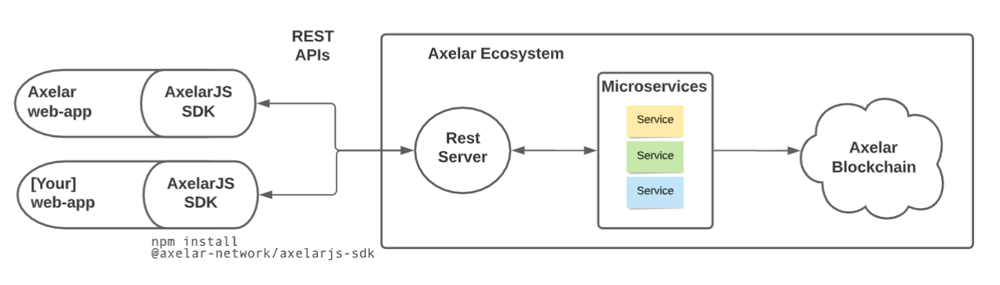

# AxelarJS SDK

## Overview

The AxelarJS SDK empowers developers to make cross-chain transfers using the Axelar network from their frontend.

### Example use case: asset transfer

AxelarJS enables the transfer of crypto assets across any blockchain supported by Axelar.

Currently supported assets and chains [TODO link to the authoritative list]:

| Supported Assets                                                                                             | Supported Blockchain Networks                                                                                             |
| ------------------------------------------------------------------------------------------------------------ | ------------------------------------------------------------------------------------------------------------------------- |
| <ul><li>AXL (Axelar native token)</li><li>LUNA (Terra native token)</li><li>UST (Terra stablecoin)</li></ul> | <ul><li>Avalanche</li><li>Axelar</li><li>Ethereum</li><li>Fantom</li><li>Moonbeam</li><li>Polygon</li><li>Terra</li></ul> |

Axelar will continue to add support for new assets and chains in the future.

## Technical overview

The AxelarJS SDK is a `npm` dependency that includes libraries that make requests into the Axelar network.



Any request from the JS SDK is routed through a node REST server that redirects requests through a coordinated collection of microservices controlled by Axelar.

These microservices facilitate the relay of cross-chain transactions that run on top of the Axelar network.

## Security mesures

AxelarJS employs security measures to protect our services from abuse. Currently every invocation of `getDepositAddress` requires frontend users to connect to a Web3 wallet and sign a message with a one-time code. Invocations to the API are also rate limited.

## Installation

```bash
npm i --save @axelar-network/axelarjs-sdk
```

## Get started

Set up the library consumer:

```typescript
import {
  AssetInfoWithTrace,
  AssetTransferObject,
  CallbackStatus,
  TransferAssetBridge,
} from "@axelar-network/axelarjs-sdk";

export class AxelarAPI {
  private environment: string;
  private axelarJsSDK: TransferAssetBridge;

  constructor(environment: string) {
    this.environment = environment;
    this.axelarJsSDK = new TransferAssetBridge(environment);
  }

  public async getOneTimeMessageToSign(
    sigerAddress: string
  ): Promise<{ validationMsg: string; otc: string }> {
    try {
      return await this.axelarJsSDK.getOneTimeCode(sigerAddress);
    } catch (e: any) {
      throw e;
    }
  }

  public async getDepositAddress(
    payload: AssetTransferObject,
    showAlerts: boolean = true
  ): Promise<AssetInfoWithTrace> {
    try {
      return this.axelarJsSDK.getDepositAddress(payload, showAlerts);
    } catch (e: any) {
      throw e;
    }
  }
}
```

Instantiate and invoke the library consumer:

```typescript
const environment: string =
  "testnet"; /*environment should be one of local | devnet | testnet | mainnet*/

const api: AxelarAPI = new AxelarAPI(environment);

/*below is sample implementation using ethers.js, but you can use whatever you want*/
const provider = new ethers.providers.Web3Provider(window.ethereum, "any"); //2nd param is network type
const signerAuthority = provider.getSigner();
const signerAuthorityAddress = signerAuthority.getAddress();

const getNoncedMessageToSign = async () => {
  const signerAuthorityAddress = await signerAuthority.getAddress();
  const { validationMsg, otc } = await api.getOneTimeMessageToSign(
    signerAuthorityAddress
  );
  return { validationMsg, otc };
};

const promptUserToSignMessage = async () => {
  const { validationMsg, otc } = await getNoncedMessageToSign();
  const signature = await signerAuthority.signMessage(validationMsg);

  return {
    otc,
    publicAddr: await signerAuthority.getAddress(),
    signature,
  };
};

const getDepositAddress = async (destinationAddress?: string) => {
  const { otc, publicAddr, signature } = await promptUserToSignMessage();
  const parameters: AssetTransferObject = getParameters(
    destinationAddress || publicAddr
  ); // wherever you specify for the destination address on the destination chain
  parameters.otc = otc;
  parameters.publicAddr = publicAddr;
  parameters.signature = signature;

  const linkAddress = await api.getDepositAddress(parameters);

  return linkAddress;
};
```

## Usage details

The `getDepositAddress` method takes the following parameters:

1. `requestPayload`: a complex struct of type `AssetTransferObject`
2. optional parameter on whether you want error alerts to show on the UI or not

Sample parameters:

```typescript
// getParameters.ts

const getParameters = (
  destinationAddress: string,
  sourceChainName: string = "terra",
  destinationChainName: string = "avalanche",
  asset_common_key: string = "uusd"
) => {
  /*
	info for sourceChainInfo and destinationChainInfo fetched from the ChainList module. 
	* */
  const terraChain: ChainInfo = ChainList.map(
    (chain: Chain) => chain.chainInfo
  ).find(
    (chainInfo: ChainInfo) =>
      chainInfo.chainName.toLowerCase() === sourceChainName.toLowerCase()
  ) as ChainInfo;
  const avalancheChain: ChainInfo = ChainList.map(
    (chain: Chain) => chain.chainInfo
  ).find(
    (chainInfo: ChainInfo) =>
      chainInfo.chainName.toLowerCase() === destinationChainName.toLowerCase()
  ) as ChainInfo;
  const assetObj = terraChain.assets?.find(
    (asset: AssetInfo) => asset.common_key === asset_common_key
  ) as AssetInfo;

  let requestPayload: AssetTransferObject = {
    sourceChainInfo: terraChain,
    destinationChainInfo: avalancheChain,
    selectedSourceAsset: assetObj,
    selectedDestinationAsset: {
      ...assetObj,
      assetAddress: destinationAddress, //address on the destination chain where you want the tokens to arrive
    },
    signature: "SIGNATURE_FROM_METAMASK_SIGN",
    otc: "OTC_RECEIVED_FROM_SERVER",
    publicAddr: "SIGNER_OF_SIGNATURE",
    transactionTraceId: "YOUR_OWN_UUID", //your own UUID, helpful for tracing purposes. optional.
  };

  return requestPayload;
};
```

## Demo

See AxelarJS in action: [deposit-address-demo](https://github.com/axelarnetwork/deposit-address-demo)

## AxelarJS is under active development

AxelarJS is under active development. The API might change. Please ensure you pull the latest from this repo post issues to Github.

## Contribute

Github issues and pull requests are welcome!

## Run locally

```bash
git clone git@github.com:axelarnetwork/axelarjs-sdk.git
cd axelarjs-sdk
npm install
npm run build
npm link # link your local repo to your global packages
npm run dev # build the files and watch for changes
```
